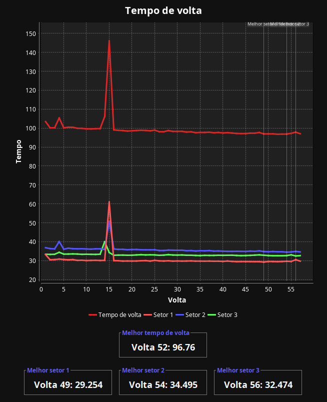
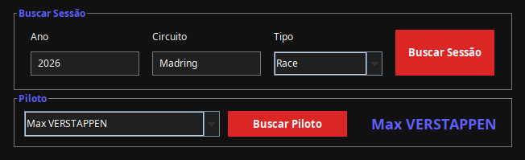
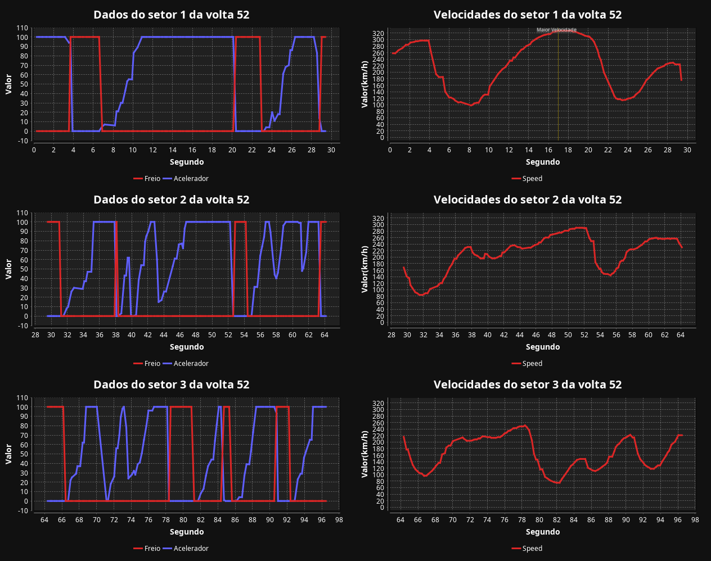

# RaceTrace

Dashboard de telemetria de Fórmula 1 desenvolvido em **Java + Swing**.

O RaceTrace utiliza a [OpenF1 API](https://openf1.org) para buscar dados reais de sessões de F1 e transformar essas informações em gráficos e indicadores sobre voltas, setores, velocidade, freio e acelerador.

O foco do projeto não foi apenas consumir uma API. Durante o desenvolvimento, trabalhei também com **arquitetura, concorrência no Swing, tratamento de dados incompletos e problemas que só apareceram quando comecei a testar com dados reais de corridas**.

## Screenshots

### Dashboard

<!-- Adicione aqui um print geral do dashboard -->



### Busca de sessão

<!-- Adicione aqui um print da tela de busca -->



### Telemetria

<!-- Adicione aqui um print dos gráficos de telemetria -->



---

## Funcionalidades

- Busca de sessões por **ano, circuito e tipo de sessão**
- Seleção de piloto dentro da sessão encontrada
- Gráfico com o **tempo de cada volta**
- Destaque da volta mais rápida e dos melhores setores
- Cards com os tempos exatos de volta e setor
- Gráfico de **freio e acelerador** durante a volta mais rápida
- Gráfico de **velocidade** durante a volta mais rápida
- Separação da telemetria por setor
- Identificação de **DNF** e **DNS** através do resultado oficial da sessão
- Reconstrução de dados quando a API retorna um setor incompleto
- Detecção de voltas anômalas causadas por situações como bandeira vermelha e safety car
- Tratamento dessas voltas sem distorcer os gráficos
- Carregamento assíncrono para evitar que a interface fique travada durante as requisições
- Indicador de carregamento e mensagens de erro
- Interface em tema escuro e iniciada maximizada

---

## Como funciona

O usuário começa escolhendo:

**Ano → Circuito → Tipo de sessão → Piloto**

Depois disso, o RaceTrace busca os dados necessários e monta o dashboard.

Os dados são carregados **sob demanda**. Ao selecionar uma sessão, o programa não baixa todas as voltas e toda a telemetria de todos os pilotos. As informações mais pesadas só são buscadas quando realmente são necessárias.

Isso reduz bastante a quantidade de requisições feitas à API.

### O dashboard

O dashboard apresenta três grupos principais de informações:

- **Voltas:** evolução do tempo de volta durante a sessão;
- **Setores:** melhores tempos dos três setores;
- **Telemetria:** velocidade, freio e acelerador durante a volta mais rápida.

Voltas consideradas inválidas não entram nos cálculos e aparecem como espaços vazios no gráfico, em vez de criarem valores que distorçam a visualização.

---

## Stack

| Categoria | Tecnologia |
|---|---|
| Linguagem | Java 21+ |
| Build | Maven |
| Interface | Swing |
| Concorrência | `SwingWorker` |
| Gráficos | JFreeChart |
| JSON | Jackson |
| HTTP | `java.net.http.HttpClient` |
| Dados | OpenF1 API |

O projeto utiliza recursos do Java 21, incluindo `SequencedCollection` e `getFirst()`.

---

## Arquitetura

O código está dividido em três pacotes principais:

```text
src/main/java/
├── principal/
│   ├── Main.java
│   ├── Service.java
│   └── Window.java
│
├── backend/
│   ├── Cliente.java
│   └── Formatter.java
│
└── model/
    ├── Sessao.java
    ├── Piloto.java
    ├── Volta.java
    ├── CarData.java
    └── SessionResult.java
```

### `principal`

Responsável pela aplicação e pela interface.

- `Main` inicia o programa.
- `Service` concentra as chamadas para a OpenF1.
- `Window` controla a interface gráfica e os gráficos.

### `backend`

Responsável pela comunicação e tratamento das respostas.

- `Cliente` cuida das requisições HTTP.
- `Formatter` transforma o JSON recebido em objetos Java usando Jackson.

### `model`

Contém os objetos utilizados pelo restante da aplicação:

- `Sessao`
- `Piloto`
- `Volta`
- `CarData`
- `SessionResult`

A ideia é evitar que a interface precise conhecer detalhes de HTTP ou JSON.

Por exemplo, `Window` não monta URLs da OpenF1. Ela pede os dados ao `Service`, que por sua vez utiliza `Cliente` e `Formatter`.

---

# Decisões técnicas

Essa parte registra algumas decisões que foram tomadas durante o desenvolvimento e, principalmente, alguns problemas que apareceram durante os testes.

## Busca sob demanda

Uma das primeiras decisões foi não carregar todos os dados de uma sessão de uma vez.

Ao buscar uma sessão, o programa inicialmente obtém apenas os pilotos. As voltas são carregadas quando o usuário seleciona um piloto e a telemetria só é buscada quando necessária para montar os gráficos.

Isso evita fazer várias requisições para dados que provavelmente nem serão visualizados.

---

## Rate limiting

A OpenF1 possui limite de requisições na API pública.

Para evitar que diferentes partes do programa precisassem controlar isso individualmente, o atraso entre requisições foi centralizado no `Cliente`.

Atualmente, existe um intervalo fixo de `300 ms` antes de cada requisição:

```java
Thread.sleep(300);
```

Assim, qualquer chamada feita pelo `Service` passa pelo mesmo controle.

---

## SwingWorker e interface travando

Esse foi um dos problemas que apareceram durante o desenvolvimento.

No início, as chamadas para a API eram executadas diretamente dentro dos eventos dos botões. Como uma busca pode envolver várias requisições HTTP, a interface ficava travada durante o processo.

O problema é especialmente perceptível no Swing porque a interface é controlada pela **Event Dispatch Thread (EDT)**.

A solução foi mover as operações de rede para um `SwingWorker`.

```text
EDT
 │
 ├── atualiza interface
 ├── recebe cliques
 │
 └── inicia SwingWorker
          │
          └── faz requisições HTTP
```

O `doInBackground()` realiza o trabalho pesado e o `done()` retorna para a EDT para atualizar a interface.

Isso também permitiu implementar o indicador de carregamento e o tratamento de erros sem bloquear a janela.

---

## Carregamento e tratamento de erros

Enquanto uma busca está acontecendo:

- a `JProgressBar` aparece em modo indeterminado;
- os controles da busca são desabilitados;
- novas requisições não podem ser iniciadas acidentalmente.

Se alguma etapa falhar, a exceção é capturada no `done()` e apresentada ao usuário através de um `JOptionPane`.

A ideia é evitar que um problema de rede simplesmente termine em uma exceção perdida no console.

---

## Dados de setores incompletos

Durante os testes, a API apresentou casos em que um setor possuía duração `0.0`.

Em vez de simplesmente descartar essa volta, o projeto tenta reconstruir o valor quando apenas um dos tempos está faltando.

A relação utilizada é:

```text
tempo da volta = setor 1 + setor 2 + setor 3
```

A lógica foi concentrada em `Volta.fixSectorDuration()` e aplicada durante a definição das voltas do piloto.

---

## Detecção de voltas anômalas

Essa foi provavelmente a parte que mais mudou durante o desenvolvimento.

### Primeira tentativa

A primeira abordagem utilizava o endpoint `race_control`, procurando eventos de bandeira vermelha através dos campos `category` e `flag`.

Nos testes com dados reais, isso não funcionou como esperado. O evento apareceu com:

```text
category: "Other"
flag: null
```

A informação da bandeira estava no texto da mensagem.

### Segunda tentativa

A detecção passou então a procurar a mensagem e utilizar o `lap_number` do evento.

Funcionou em um primeiro teste, mas apareceu outro problema quando vários pilotos eram analisados.

O número da volta do `race_control` representa a corrida como um todo, enquanto o número da volta retornado para cada piloto pode ficar desalinhado.

Assim, o mesmo evento poderia acabar sendo associado a voltas diferentes dependendo do piloto.

### Solução atual

A abordagem final não depende do `race_control`.

O projeto verifica diretamente a duração dos setores através de `Volta.abnormalSector()`.

Atualmente, um setor acima de **300 segundos** é considerado anômalo.

Essas voltas são retiradas dos cálculos e tratadas separadamente no gráfico.

Essa solução acabou sendo mais simples do que tentar sincronizar os números de volta de dois endpoints diferentes.

---

## Voltas brutas e voltas válidas

O `Piloto` mantém duas coleções:

```text
voltas
voltasValidas
```

`voltas` contém os dados recebidos da API.

`voltasValidas` contém apenas as voltas que podem ser utilizadas nos cálculos.

Os cálculos de:

- melhor volta;
- melhor setor;
- pico de velocidade;

utilizam somente as voltas válidas.

Dessa forma, uma volta com dados incompletos ou anômalos não interfere nos resultados.

---

## DNF e DNS

O projeto não tenta descobrir se um piloto abandonou a corrida através de heurísticas como comparar o número de voltas.

Em vez disso, utiliza o resultado oficial da sessão através do endpoint `session_result`.

O `driver_number` é usado para associar o resultado ao piloto correspondente.

---

## Espaços vazios no gráfico

Quando uma volta é considerada inválida, o gráfico recebe `null` para aquele ponto.

Isso é diferente de colocar `0` ou simplesmente remover a volta.

O JFreeChart interpreta o `null` como ausência de dado e deixa um espaço na linha:

```text
volta válida ──────┐
                   │
                   │  ← sem dado
                   │
                   └────── volta válida
```

Assim, o gráfico não conecta artificialmente os pontos que estão dos dois lados da volta inválida.

---

## Circuito em vez de país

A busca inicialmente utilizava o país como filtro.

Isso criava ambiguidade, já que um mesmo país pode possuir mais de um circuito ou receber diferentes eventos ao longo dos anos.

A busca passou então a utilizar o `circuit_short_name`.

Também foi necessário codificar os parâmetros antes de colocá-los na URL, principalmente em nomes com espaços, como:

```text
Sprint Qualifying
```

---

## Tipo de sessão como dropdown

O tipo de sessão começou como um campo de texto livre.

Isso fazia com que uma pequena diferença na digitação pudesse gerar uma busca inválida.

Agora os valores disponíveis são definidos diretamente em um `JComboBox`, com opções como:

```text
Practice 1
Practice 2
Practice 3
Sprint
Sprint Qualifying
Qualifying
Race
```

Isso reduz os erros de entrada e deixa a busca mais previsível.

---

# Estrutura do projeto

```text
src/main/java/
├── principal/
│   ├── Main.java              # ponto de entrada
│   ├── Service.java           # chamadas à API e regras de busca
│   └── Window.java            # interface gráfica
│
├── backend/
│   ├── Cliente.java           # cliente HTTP
│   └── Formatter.java         # desserialização JSON
│
└── model/
    ├── Sessao.java
    ├── Piloto.java
    ├── Volta.java
    ├── CarData.java
    └── SessionResult.java
```

---

# Como rodar

### Pré-requisitos

- JDK 21 ou superior
- Maven
- Conexão com a internet

A OpenF1 é utilizada como fonte de dados pública e não exige uma chave de API para o uso feito pelo projeto.

### Maven

Clone o repositório e execute:

```bash
mvn clean compile exec:java -Dexec.mainClass="principal.Main"
```

Também é possível executar `Main.java` diretamente pela IDE.

---

# Limitações conhecidas

- O limite de `300 segundos` para detectar voltas anômalas é fixo. Uma parada nos boxes excepcionalmente longa pode ser classificada como anômala mesmo sem uma interrupção de corrida.
- Se todas as voltas de um piloto forem consideradas inválidas, os gráficos ficam vazios atualmente.
- Dados de pit stop não são exibidos. Esse recurso foi retirado do escopo atual do projeto.
- A aplicação depende da disponibilidade da OpenF1 API.

---


## Autor

Desenvolvido por **Davi Rodrigues**.

[GitHub](https://github.com/dmrodrigues-dev)

Se encontrar algum problema ou tiver uma sugestão, fique à vontade para abrir uma issue.